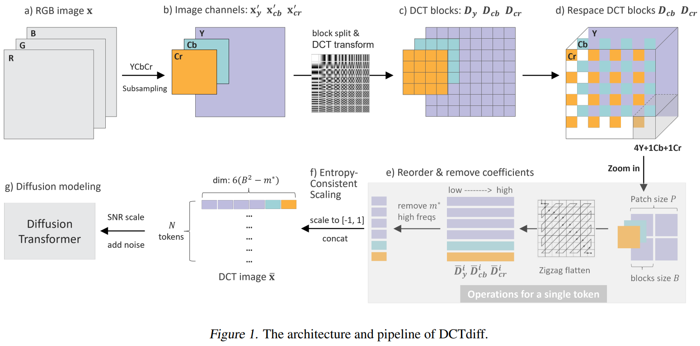

## DCTdiff

Official PyTorch implementation of [DCTdiff: Intriguing Properties of Image Generative Modeling in the DCT Space](https://arxiv.org/abs/2412.15032)

The repository is based on [UViT](https://github.com/baofff/U-ViT). We keep the UViT code unchanged in the UViT branch where you can find our baseline implementation.

We will also release the DCTdiff based on [DiT](https://github.com/facebookresearch/DiT) in the near future




## Installation

The installation works both for DCTdiff and UViT


```sh
conda create -n dctdiff python==3.9
conda activate dctdiff

pip install matplotlib
pip install accelerate==0.33.0   # (auto install pytorch 2.4)
pip install absl-py ml_collections einops wandb ftfy==6.1.1 transformers==4.23.1
pip install opencv-python
pip install scipy

# xformers is optional, but it would greatly speed up the attention computation.
pip install -U xformers
pip install torchvision==0.19.0
```


## Pretrained Models

| Model | FID-50k (50NFE, DPM-Solver) | training steps | batch size |
|:----------------------------------------------------------------------------------------------------------------------------------------------------------------------------------------------------------------------------------------------------------------------------------------------------------------------------------------------------------------------------------------------------------------------------------------------------------------------------------------------------------------------------------------:|:---------------------------:|:--------------:|:----------:|
|[CIFAR10 (DCTdiff-M/4)](https://drive.google.com/file/d/14eJ-M2022qjdJxTIZbhSKe6RMbQao-K-/view?usp=sharing) |            5.54             |      175k      |    256     |
|[CelebA 64x64 (DCTdiff-S/4)](https://drive.google.com/file/d/1kItTgrqf5k4972QFMZP8NUhbfhbLAvN4/view?usp=sharing) |            1.85             |      225k      |    256     |
|[ImageNet 64x64 (DCTdiff-S/4)](https://drive.google.com/file/d/1JvVYP7NNJACR-atYrxiTd2rX6uhbgMJn/view?usp=sharing) |            9.93             |      475k      |    1024    |
|[FFHQ 128x128 (DCTdiff-S/8)](https://drive.google.com/file/d/1iCQm_WX5AApyaJVuVeFAZBU1S9mI6BGB/view?usp=sharing) |            6.46             |      300K      |    256     |
|[FFHQ 256x256 (DCTdiff-M/8)](https://drive.google.com/file/d/16CxB5QUi5pVfvLonggicKgYQOeiF5AP2/view?usp=sharing) |            5.62             |      200k      |    256     |


## Preparation Before Training and Evaluation

#### Data
Each dataset is organized in a 'folder' format. You can either use jpg or png for the datasets.

But note that, if you use png images for training, your generated images must be saved into png as well before computing FID.
In our experiments, we use jpg images and the fid_stats is computed from the jpg image folder.


* CIFAR-10 32x32: we provide a script (`tools/download_cifar10.py`) to download CIFAR-10
* CelebA 64x64: download the [dataset](https://drive.usercontent.google.com/download?id=0B7EVK8r0v71pZjFTYXZWM3FlRnM&authuser=0), then do center crop to 64x64 using the script `tools/dataset_celeba64.py`.
* ImageNet 64x64: download the [dataset](https://www.kaggle.com/datasets/ayaroshevskiy/downsampled-imagenet-64x64), use the `train` folder for training.
* FFHQ 128x128: download the [dataset](https://www.kaggle.com/datasets/greatgamedota/ffhq-face-data-set)
* FFHQ 256x256: download the [dataset](https://www.kaggle.com/datasets/rahulbhalley/ffhq-256x256)


#### Reference statistics for FID
Download `fid_stats` directory from this [link](https://drive.google.com/drive/folders/1WvLoI73O1HXyleg2jWzginlFJ5eJ_s-b?usp=sharing) (which contains reference statistics for FID).

Put the downloaded `fid_stats` into directory `assets/fid_stats`, the path of `fid_stats` is set in the script `datasets.py` for FID comutation in both training and inference.

Using [pytorch-FID](https://github.com/mseitzer/pytorch-fid), you can also 
* generate your own fid_stats for a given dataset
* compute the FID whenever you need.

```shell
python -m pytorch_fid --save-stats path/to/dataset_folder path/to/fid_stats  # generate fid_stats
python -m pytorch_fid path/to/dataset1_folder/to/dataset2_folder  # FID calculation
```


#### Parameters (eta, entropy, m*)
We have provided all DCT-related parameters in the config files `configs`,  

If you need to train on the other datasets, please use the script `DCT_datasets_statis.py` to compute `eta` and `entropy`, or determine `m*`


## Training

We use the [huggingface accelerate](https://github.com/huggingface/accelerate) library to help train with distributed data parallel and mixed precision.

We provide all commands to reproduce DCTdiff training in the paper (4xA100 are used for all experiments):

Feel free to change the sampler, NFE and num_samples in the config file.

```sh
# CIFAR10 32x32 (DCTdiff-M/4)
accelerate launch --multi_gpu --num_processes 4 --mixed_precision fp16 train.py --config=configs/cifar10_uvit_mid_2by2.py --workdir YOUR_DIR

# CelebA 64x64 (DCTdiff-S/4)
accelerate launch --multi_gpu --num_processes 4 --mixed_precision fp16 train.py --config=configs/celeba64_uvit_small_2by2.py --workdir YOUR_DIR

# ImageNet 64x64 (DCTdiff-S/4)
accelerate launch --multi_gpu --num_processes 4 --mixed_precision fp16 train.py --config=configs/imgnet64_uvit_small_2by2.py --workdir YOUR_DIR

# FFHQ 128x128 (DCTdiff-S/8)
accelerate launch --multi_gpu --num_processes 4 --mixed_precision fp16 train.py --config=configs/ffhq128_uvit_small_4by4.py --workdir YOUR_DIR

# FFHQ 256x256 (DCTdiff-M/8)
accelerate launch --multi_gpu --num_processes 4 --mixed_precision fp16 train.py --config=configs/ffhq256_uvit_mid_4by4.py --workdir YOUR_DIR
```


## Evaluation (Compute FID)

We use the [huggingface accelerate](https://github.com/huggingface/accelerate) library for efficient inference with mixed precision and multiple gpus. The following is the evaluation command:


We provide all commands to reproduce FID results in the paper:
```sh
# CIFAR10 32x32 (DCTdiff-M/4)
accelerate launch --multi_gpu --num_processes 4 --mixed_precision fp16 eval.py --config=configs/cifar10_uvit_mid_2by2.py --nnet_path=cifar10_DCTdiff_mid_2by2.pth --output_path YOUR_DIR

# CelebA 64x64 (DCTdiff-S/4)
accelerate launch --multi_gpu --num_processes 4 --mixed_precision fp16 eval.py --config=configs/celeba64_uvit_small_2by2.py --nnet_path=celeba64_DCTdiff_small_2by2.pth --output_path YOUR_DIR

# ImageNet 64x64 (DCTdiff-S/4)
accelerate launch --multi_gpu --num_processes 4 --mixed_precision fp16 eval.py --config=configs/imgnet64_uvit_small_2by2.py --nnet_path=imgnet64_DCTdiff_small_2by2.pth --output_path YOUR_DIR

# FFHQ 128x128 (DCTdiff-S/8)
accelerate launch --multi_gpu --num_processes 4 --mixed_precision fp16 eval.py --config=configs/ffhq128_uvit_small_4by4.py --nnet_path=ffhq128_DCTdiff_small_4by4.pth --output_path YOUR_DIR

# FFHQ 256x256 (DCTdiff-M/8)
accelerate launch --multi_gpu --num_processes 4 --mixed_precision fp16 eval.py --config=configs/ffhq256_uvit_mid_4by4.py --nnet_path=ffhq256_DCTdiff_mid_4by4.pth --output_path YOUR_DIR
```


## References
If you find the code useful for your research, please consider citing
```bib
@article{ning2024dctdiff,
  title={DCTdiff: Intriguing Properties of Image Generative Modeling in the DCT Space},
  author={Ning, Mang and Li, Mingxiao and Su, Jianlin and Jia, Haozhe and Liu, Lanmiao and Bene{\v{s}}, Martin and Salah, Albert Ali and Ertugrul, Itir Onal},
  journal={arXiv preprint arXiv:2412.15032},
  year={2024}
}
```